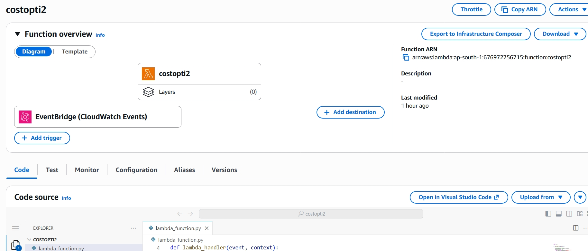
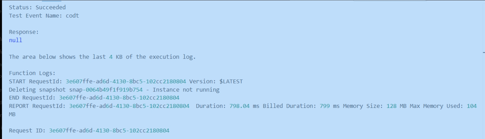

# AWS Cost Optimization — Automated EBS Snapshot Management

A serverless, event-driven solution that automatically identifies and removes stale EBS snapshots on AWS. Built with Python (Boto3) and triggered daily via Amazon EventBridge, this project eliminates manual cloud cost audits and reduces unnecessary AWS storage spend.

---

## Overview

EBS snapshots accumulate silently over time — from terminated instances, deleted volumes, or forgotten backups. Left unmanaged, they generate recurring costs with no operational value. This Lambda function runs on a daily schedule, evaluates every snapshot in the account, and deletes those that no longer serve a purpose.

**Verified working in production:**
```
Deleting snapshot snap-0064b49f1f919b754 — Instance not running
Deleting snapshot snap-0843bafa0c4764e0e — No associated volume found
Status: Succeeded | Duration: 798ms | Memory: 104MB
```

---

## Architecture

```
Amazon EventBridge
(Scheduled Rule — daily)
          |
          v
AWS Lambda Function
          |
          |-- Fetch all EC2 instances (filter: running)
          |-- Fetch all EBS snapshots (OwnerIds: self)
          |
          |-- For each snapshot:
          |
          |     No volume ID found
          |     └── delete_snapshot() — No associated volume
          |
          |     Volume ID exists, volume not found in AWS
          |     └── delete_snapshot() — Volume not found
          |
          |     Volume found, no instance attachment
          |     └── delete_snapshot() — Volume not attached
          |
          |     Volume attached, instance is not running
          |     └── delete_snapshot() — Instance not running
          |
          |     Volume attached, instance is running
          |     └── Retain snapshot (actively in use)
          |
          v
     CloudWatch Logs
     (Full audit trail of every deletion)
```

---

## Screenshots

**Lambda function with EventBridge trigger configured:**



**Successful execution — stale snapshot identified and deleted:**



---

## Tech Stack

| Component | Technology |
|-----------|-----------|
| Runtime | Python 3.x |
| AWS SDK | Boto3 |
| Compute | AWS Lambda |
| Scheduler | Amazon EventBridge |
| Permissions | IAM Role with least-privilege policy |
| Logging | Amazon CloudWatch Logs |
| Region | ap-south-1 |

---

## Source Code

```python
import boto3
from botocore.exceptions import ClientError

def lambda_handler(event, context):
    ec2 = boto3.client('ec2')

    # 1. Fetch all EC2 instances and filter running ones
    instances_response = ec2.describe_instances()
    running_instance_ids = []
    for reservation in instances_response['Reservations']:
        for instance in reservation['Instances']:
            if instance['State']['Name'] == 'running':
                running_instance_ids.append(instance['InstanceId'])

    # 2. Fetch all EBS snapshots owned by this account
    snapshots_response = ec2.describe_snapshots(OwnerIds=['self'])

    for snapshot in snapshots_response['Snapshots']:
        snapshot_id = snapshot['SnapshotId']
        volume_id = snapshot.get('VolumeId')

        if not volume_id:
            # Snapshot has no associated volume — safe to delete
            delete_snapshot(ec2, snapshot_id, "No associated volume")
            continue

        try:
            # Fetch the volume associated with this snapshot
            volume_response = ec2.describe_volumes(VolumeIds=[volume_id])

            if not volume_response['Volumes']:
                # Volume no longer exists in AWS
                delete_snapshot(ec2, snapshot_id, "Volume not found")
                continue

            volume = volume_response['Volumes'][0]
            attachments = volume.get('Attachments', [])

            if not attachments:
                # Volume exists but is not attached to any instance
                delete_snapshot(ec2, snapshot_id, "Volume not attached")
                continue

            # Volume is attached — check if the instance is actually running
            instance_id = attachments[0]['InstanceId']
            instance_response = ec2.describe_instances(InstanceIds=[instance_id])
            instance = instance_response['Reservations'][0]['Instances'][0]

            if instance['State']['Name'] != 'running':
                # Instance is stopped or terminated — snapshot is no longer needed
                delete_snapshot(ec2, snapshot_id, "Instance not running")

        except ClientError as e:
            if e.response['Error']['Code'] == 'InvalidVolume.NotFound':
                print(f"Deleting snapshot {snapshot_id} - Volume not found")
                ec2.delete_snapshot(SnapshotId=snapshot_id)
            else:
                print(f"Skipping {snapshot_id} - Unexpected error: {str(e)}")


def delete_snapshot(ec2, snapshot_id, reason):
    """Helper function to delete a snapshot and log the reason."""
    print(f"Deleting snapshot {snapshot_id} - {reason}")
    ec2.delete_snapshot(SnapshotId=snapshot_id)
```

---

## Deletion Logic — Decision Tree

| Condition | Action |
|-----------|--------|
| Snapshot has no volume ID | Delete |
| Volume ID exists but volume not found in AWS | Delete |
| Volume found but not attached to any instance | Delete |
| Volume attached, instance is stopped/terminated | Delete |
| Volume attached, instance is running | Retain |

---

## IAM Policy

Attach the following least-privilege policy to the Lambda execution role:

```json
{
  "Version": "2012-10-17",
  "Statement": [
    {
      "Effect": "Allow",
      "Action": [
        "ec2:DescribeInstances",
        "ec2:DescribeSnapshots",
        "ec2:DescribeVolumes",
        "ec2:DeleteSnapshot"
      ],
      "Resource": "*"
    }
  ]
}
```

---

## Deployment

**1. Create the Lambda function**
```
Runtime: Python 3.x
Handler: lambda_function.lambda_handler
Memory:  128 MB
Timeout: 60 seconds
```

**2. Attach IAM permissions**
```
Navigate to IAM → Roles → [Lambda execution role]
Attach the policy defined above
```

**3. Configure EventBridge trigger**
```
Source:     EventBridge (CloudWatch Events)
Rule type:  Schedule
Expression: rate(1 day)
Target:     Lambda function
```

**4. Deploy and test**
```
Deploy the function code
Create a test event with an empty payload: {}
Verify execution logs in CloudWatch
```

---

## Impact

- Automated cleanup of unused EBS snapshots
- Prevents accumulation of orphaned storage
- Reduces unnecessary AWS storage costs

---

## Execution Metrics

| Metric | Value |
|--------|-------|
| Execution Status | Succeeded |
| Duration | 798 ms |
| Billed Duration | 799 ms |
| Memory Allocated | 128 MB |
| Memory Used | 104 MB |
| Trigger | EventBridge — Daily schedule |
| AWS Region | ap-south-1 |

---

## Repository Structure

```
aws-cost-optimization/
├── lambda_function.py      # Core Lambda handler
├── screenshots/
│   ├── lambda-trigger.png  # EventBridge trigger configuration
│   └── execution.png       # Successful execution output
└── README.md
```

---

## Author

Arnav Verma
GitHub: [Arnav2354](https://github.com/Arnav2354)

---

## License

Apache License 2.0
